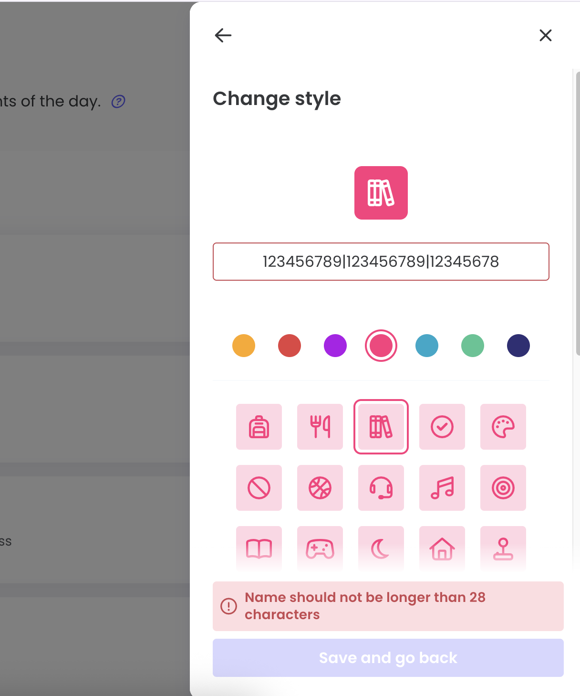

# Routines UI Bug Reports
This document contains UI bug report discovered during manual testing 
of the Routines feature in the Qustodio web application (parent experience). 

## BUG-01: Error message appears when routine name length is exactly 28 characters

**Severity**: Medium  
**Priority**: Medium

### Description
When routine name is exactly 28 characters, the UI displays an error: "Name should not be longer than 28 characters".
The **Save and go back** button becomes disabled and user cannot save a valid routine name.

### Precondition
- Logged in as Parent
- On the **Change style** screen (during routine creation or editing)

### Steps to Reproduce
1. Open a routine (create or edit)
2. Go to the **Change style** screen
3. Enter a name that contains exactly 28 characters (e.g. `123456789|123456789|12345678`)
4. Observe the error message and button state

### Expected Result
No error message is shown, and the **Save and go back** button remains active and user can save the routine name.

### Actual Result
An error message appears: "Name should not be longer than 28 characters", 
and the **Save and go back** button is disabled.

### Environment
- OS: macOS 14.5
- Browser: Chrome 126.0.0.1
- User role: Parent

### Attachments
